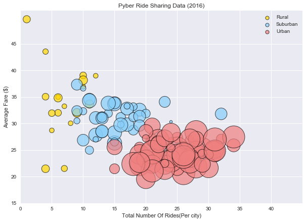
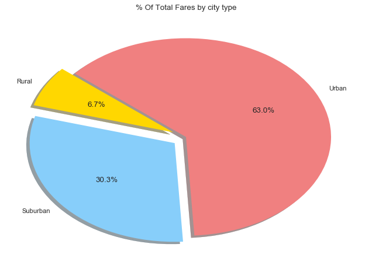
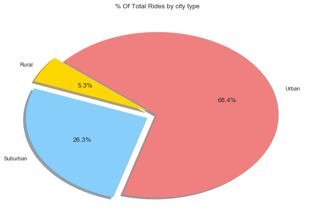
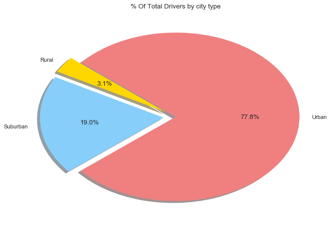

# Pyber Rider Sharing

#  Analysis
### ObservedTrend1:From the satter plot urban people using more rides than others so they have the less avg fare.
### ObservedTrend2: From the below  pie charts  urban people have more % of total fares,total rides and total drivers have than others.
### ObservedTrend3:Rural people are not using much of ride facility.


```python
#Dependencies
import pandas as pd
import numpy as np
import random
import matplotlib.pyplot as plt   
import seaborn as sns

```


```python
#Declariing csv files
file="city_data.csv"
file1="ride_data.csv"
```


```python
 #Creating a DataFRame
citymaster_df=pd.read_csv(file)
citymaster_df.head()
ride_df=pd.read_csv(file1)
   
ride_df.groupby('city')


city_df=pd.DataFrame({"Totalrides":ride_df.groupby('city')['ride_id'].count(),
                     "Avgfare":ride_df.groupby('city')["fare"].mean(),
                      "CityType":citymaster_df.groupby("city")["type"].max(),
                      "TotalDrivers":citymaster_df.groupby("city")["driver_count"].sum(),
                      "Total Fares":ride_df.groupby('city')["fare"].sum()
                      })

city_df.head()
#city_df.groupby("type").Avgfare.count()

```


<div>
<style>
    .dataframe thead tr:only-child th {
        text-align: right;
    }

    .dataframe thead th {
        text-align: left;
    }

    .dataframe tbody tr th {
        vertical-align: top;
    }
</style>
<table border="1" class="dataframe">
  <thead>
    <tr style="text-align: right;">
      <th></th>
      <th>Avgfare</th>
      <th>CityType</th>
      <th>Total Fares</th>
      <th>TotalDrivers</th>
      <th>Totalrides</th>
    </tr>
    <tr>
      <th>city</th>
      <th></th>
      <th></th>
      <th></th>
      <th></th>
      <th></th>
    </tr>
  </thead>
  <tbody>
    <tr>
      <th>Alvarezhaven</th>
      <td>23.928710</td>
      <td>Urban</td>
      <td>741.79</td>
      <td>21</td>
      <td>31</td>
    </tr>
    <tr>
      <th>Alyssaberg</th>
      <td>20.609615</td>
      <td>Urban</td>
      <td>535.85</td>
      <td>67</td>
      <td>26</td>
    </tr>
    <tr>
      <th>Anitamouth</th>
      <td>37.315556</td>
      <td>Suburban</td>
      <td>335.84</td>
      <td>16</td>
      <td>9</td>
    </tr>
    <tr>
      <th>Antoniomouth</th>
      <td>23.625000</td>
      <td>Urban</td>
      <td>519.75</td>
      <td>21</td>
      <td>22</td>
    </tr>
    <tr>
      <th>Aprilchester</th>
      <td>21.981579</td>
      <td>Urban</td>
      <td>417.65</td>
      <td>49</td>
      <td>19</td>
    </tr>
  </tbody>
</table>
</div>


```python
# creating a Scatterplot
fig=plt.figure(figsize=(10,7))
types = city_df.CityType.unique()
types.sort()
colors =['gold','LightSkyBlue','LightCoral']
for i, t in enumerate(types):
    c = city_df[city_df['CityType'] == t]
    a = plt.scatter(c['Totalrides'],
            c['Avgfare'],
            s=c["TotalDrivers"]*30,
            c=colors[i],
            edgecolor="black",   
            marker="o",
            alpha=0.7,
            facecolor='gray',        
            linewidths=1,        
            label=t)
    #handleList.append(a)
lgnd = plt.legend(loc="upper right") 
for handle in lgnd.legendHandles:
    handle.set_sizes([50])
plt.title("Pyber Ride Sharing Data (2016)")
plt.ylabel("Average Fare ($)")
plt.xlabel("Total Number Of Rides(Per city)")
plt.grid(True)
sns.set()
plt.xticks(np.arange(0,41,5))
plt.xlim(0,40+5)
plt.yticks(np.arange(15,50,5))

plt.show()

```





# Total Fares By City Type


```python
pie_df=pd.DataFrame({"ridespercentage":np.round((city_df.groupby('CityType')['Totalrides'].sum())/ (city_df['Totalrides'].sum())*100,2),
                "DriversPercentage":np.round((city_df.groupby('CityType')['TotalDrivers'].sum()/city_df['TotalDrivers'].sum())*100,2),
                "farespercentage":np.round((city_df.groupby('CityType')["Total Fares"].sum()/city_df['Total Fares'].sum())*100,2)})
pie_df.sort_index()
pie_df
#city_df.head()
```


<div>
<style>
    .dataframe thead tr:only-child th {
        text-align: right;
    }

    .dataframe thead th {
        text-align: left;
    }

    .dataframe tbody tr th {
        vertical-align: top;
    }
</style>
<table border="1" class="dataframe">
  <thead>
    <tr style="text-align: right;">
      <th></th>
      <th>DriversPercentage</th>
      <th>farespercentage</th>
      <th>ridespercentage</th>
    </tr>
    <tr>
      <th>CityType</th>
      <th></th>
      <th></th>
      <th></th>
    </tr>
  </thead>
  <tbody>
    <tr>
      <th>Rural</th>
      <td>3.11</td>
      <td>6.68</td>
      <td>5.26</td>
    </tr>
    <tr>
      <th>Suburban</th>
      <td>19.05</td>
      <td>30.35</td>
      <td>26.32</td>
    </tr>
    <tr>
      <th>Urban</th>
      <td>77.84</td>
      <td>62.97</td>
      <td>68.42</td>
    </tr>
  </tbody>
</table>
</div>


```python
# Creating a pie chart for % of total fares
explode=(0.1,0.1,0)
plt.figure(figsize=(10, 7),dpi=80)

plt.pie(pie_df['farespercentage'] ,explode=explode,colors=colors,labels=pie_df['farespercentage'].keys(),
        autopct="%1.1f%%",shadow=True,startangle=140)
plt.title("% Of Total Fares by city type" )
plt.axis("off")
plt.show()
```





# Total Rides by City Type


```python
# Creating a pie chart for % of total Rides
explode=(0.09,0.09,0)
plt.figure(figsize=(10, 7),dpi=80)
plt.pie(pie_df['ridespercentage'] ,explode=explode,labels=types,colors=colors,
        autopct="%1.1f%%",shadow=True,startangle=140)
plt.title("% Of Total Rides by city type")
plt.axis("off")
plt.show()

```





# Total Drivers By City Type


```python
# Creating a pie chart for % of total drivers
explode=(0.1,0.1,0)
plt.figure(figsize=(10, 7),dpi=80)
plt.pie(pie_df['DriversPercentage'] ,explode=explode,labels=types,colors=colors,
        autopct="%1.1f%%",shadow=True,startangle=140)
plt.title("% Of Total Drivers by city type")
plt.axis("off")
plt.show()
```





```python


```


```python

```
